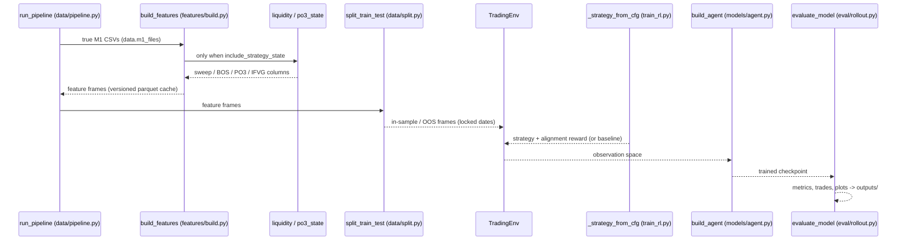
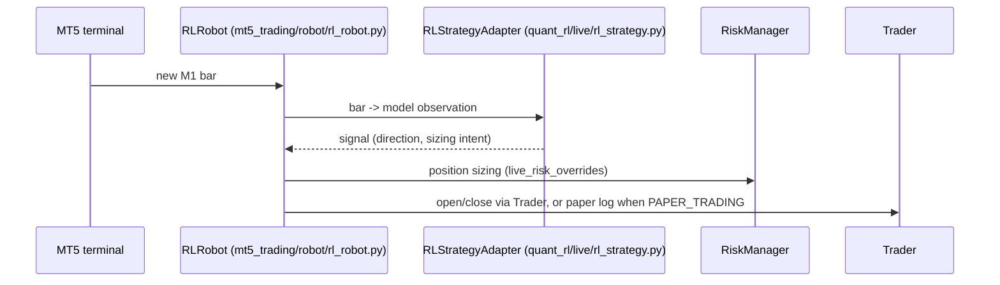
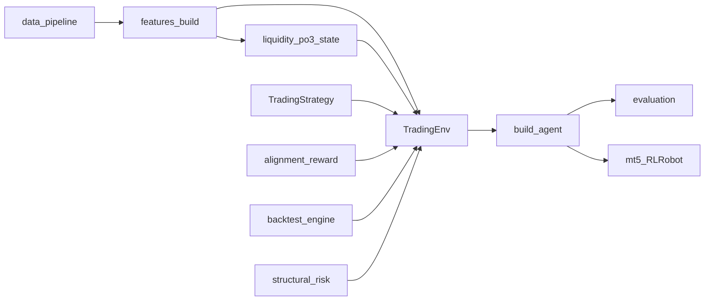
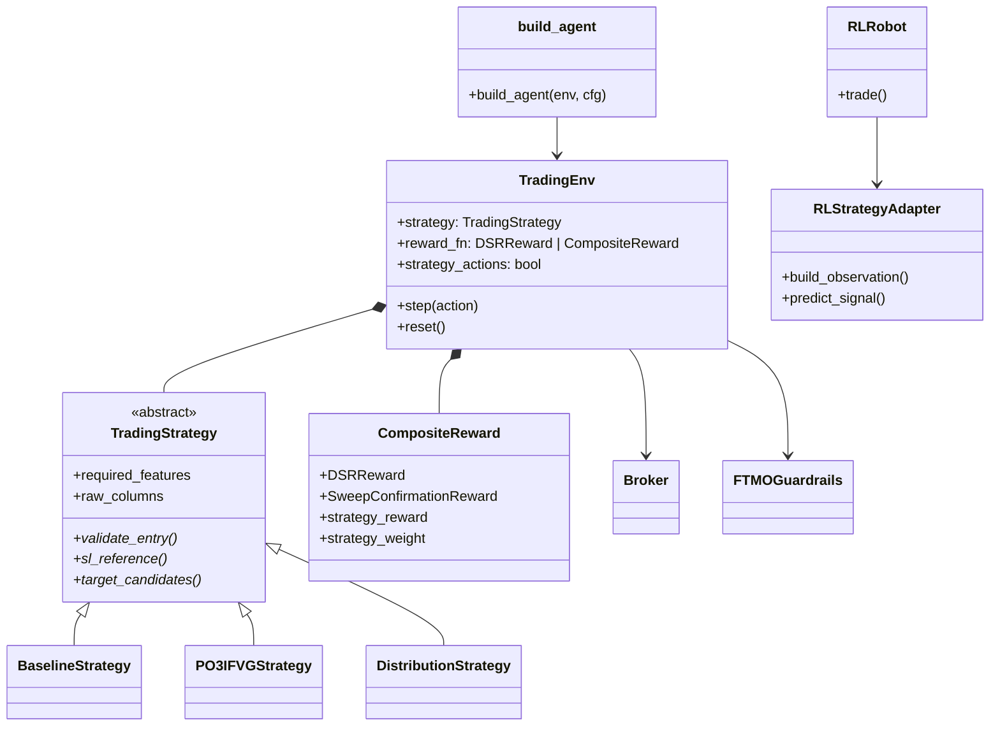

# Quantitative RL Trading System: Architecture

- [Introduction](#introduction)
- [Terminology](#terminology)
- [Disclaimers](#disclaimers)
- [Scope](#scope)
- [End-to-end procedure](#end-to-end-procedure)
- [Architecture](#architecture)
- [Lifecycle of one cycle](#lifecycle-of-one-cycle)
  - [Data and cache](#data-and-cache)
  - [Feature chains and strategy state](#feature-chains-and-strategy-state)
  - [Environment step](#environment-step)
  - [Training, evaluation and walk-forward](#training-evaluation-and-walk-forward)
  - [Live: paper first, then promote](#live-paper-first-then-promote)
- [Budgets and constraints](#budgets-and-constraints)
- [Causal-only rule](#causal-only-rule)
- [Adding a strategy](#adding-a-strategy)
- [References](#references)

## Introduction

This describes how the repository turns raw M1 price files into a trained
reinforcement-learning agent and, optionally, a live trading robot: the data
pipeline, the feature builders, the `TradingEnv` contract, the backtest
engine, the training and evaluation entry points, and the live bridge.

This page documents the **framework**: the pipeline stages, the contracts
between them, and the invariants that hold across every configuration.
*What* a particular strategy trades - the PO3/IFVG chain of Idea 1 or the
distribution chain of Idea 2 - is documented in the modules that own it
(`quant_rl/envs/strategies/` plus `config/idea1_po3_ifvg.yaml` /
`config/idea2_distribution.yaml`) and is linked rather than duplicated here
as a tutorial. [Adding a strategy](#adding-a-strategy) describes how a new
one is plugged in.

How-to material lives elsewhere and is not repeated:

- [`README.md`](../README.md) — installation, quick start, project layout.
- [`config.md`](config.md) — YAML config catalog and cache versioning.
- [`RUNNING_COMMANDS.md`](operations/RUNNING_COMMANDS.md) — every command a typical
  research or evaluation session needs.
- [`DEPLOYMENT.md`](operations/DEPLOYMENT.md) — the paper-to-live promotion protocol.

## Terminology

**M1 spine**
   One-minute bars are the only true source data. Every higher timeframe is
   resampled from the M1 files named under `data.m1_files` in
   `quant_rl/config/default.yaml`; separately downloaded higher-TF CSVs are
   ignored (see [Disclaimers](#disclaimers)).

**HTF / LTF**
   Higher timeframe (M15 FVG zones) and lower timeframe (M5 confirmations)
   in the multi-timeframe signal stack.

**OOS split**
   The locked train/out-of-sample boundary in `data.split`:
   in-sample is `train_end` inclusive, out-of-sample starts at
   `test_start`. Ideas may not move these dates (see
   [Budgets and constraints](#budgets-and-constraints)).

**Causal feature**
   A feature column whose value at bar `t` is computed only from
   information available at decision time `t`. See
   [Causal-only rule](#causal-only-rule).

**Overlay vs baseline**
   The strategy machinery added on top of the baseline (Idea 3)
   configuration. Baseline behaviour is the reference; Idea 1/2 are strict
   opt-in overlays (see [Overlay invariant](#overlay-invariant)).

**`TradingStrategy` vs `TradingEnv`**
   A strategy object owns *semantics only*: whether an entry is valid at
   bar `t`, where the structural stop reference sits, and which
   take-profit targets are candidates. The environment owns all *mechanics*:
   fills, lot sizing, account state, costs, guardrails and logging
   (`quant_rl/envs/strategies/__init__.py`).

**Observation `seq` / `account`**
   The environment's observation is a dictionary: `seq` is the normalised
   60-bar feature window (plus optional VAE latent `vae_z`), `account` is
   the scalar account state. Raw price-level columns requested by a
   strategy (`raw_columns`) are kept for execution but excluded from the
   normalised sequence.

**Discrete vs strategy action space**
   Legacy spaces: `Discrete(20)` (`0` hold, `1-9` enter-long variants,
   `10-18` enter-short variants, `19` exit) or a 1-D `Box(-1, 1)` for
   proportional sizing. Strategy mode replaces these with one 4-D
   `Box` `[direction, risk, rr, tp]` (see [Environment step](#environment-step)).

**DSR vs sweep vs entry-event rewards**
   Three reward layers combined by `CompositeReward`: the economic
   Differential Sharpe Ratio (`DSRReward`), an optional
   `SweepConfirmationReward`, and an optional strategy *alignment* reward
   (`PO3Reward` / `DistributionReward`) that fires on entry transitions
   only.

**Liquidity sweep vs BOS**
   A sweep is a push through a prior swing level followed by a reclaim; a
   break of structure is a confirmed close beyond a swing level. Both are
   detected causally in `quant_rl/features/liquidity.py`.

**Manipulation vs distribution phase**
   The two PO3 stages tracked in `quant_rl/features/po3_state.py`:
   the manipulation sweep that runs against the eventual direction, and the
   distribution leg that follows it.

**FTMO limits vs `live_risk_overrides`**
   Training/evaluation enforce the *dollar* kill-switches of the `ftmo:`
   block via guardrails; live MT5 sizing uses the *percentage-of-balance*
   block `live_risk_overrides:`. The two must stay aligned
   (`quant_rl/config/default.yaml`).

**Paper vs live**
   `PAPER_TRADING=true` (the default) logs every signal and intended order
   without placing anything; `PAPER_TRADING=false` routes orders to the
   broker.

## Disclaimers

- **Higher-TF CSVs are ignored.** All timeframes are resampled from the
  true M1 files named in `data.m1_files`; a separately downloaded M5/H1
  file is never read. Tick files (`data.tick_files`) are used only for
  fill pricing when `costs.use_tick_execution` is on.
- **The feature cache is versioned.** Feature pipelines are cached as
  parquet keyed by `FEATURE_CACHE_VERSION` (currently
  `v8-full-day-completed-htf-swings` in `quant_rl/features/build.py`).
  Bar caches use `BAR_CACHE_VERSION` (`v2-full-day` in
  `quant_rl/data/pipeline.py`). A schema change must bump the relevant
  version; stale caches are otherwise silently reused.
- **Opt-in feature blocks are config-driven.** Overlay columns
  (`include_strategy_state`, `include_session_ohlc`, MTF expansion flags)
  are toggled by variant YAMLs under `config/`. All runs share the same
  cache key; changing flags requires `--force` or deleting the stale
  parquet so columns are rebuilt.
- **OOS dates are locked in `default.yaml`.** `data.split.train_end` /
  `test_start` are the single source of truth for the split; variant
  configs must not override them.
- **`PAPER_TRADING` defaults to true.** The live entry point
  (`live_trading_rl.py`) logs signals only unless paper mode is
  explicitly disabled.
- **Training dollar caps and live percentage sizing must stay aligned.**
  `ftmo:` (dollar kill-switches) and `live_risk_overrides:` (% of
  balance) encode the same risk appetite for different units; changing
  one without the other silently diverges training from live sizing.
- **Strategy registration is config-time only.** A strategy is selected
  through `_STRATEGY_CONFIGS` in `quant_rl/train/train_rl.py` and the
  merged YAML; there is no runtime plugin loader.
- **The overlay is strict (see [Overlay invariant](#overlay-invariant)).** With
  `env.strategy_actions=false` (default), the environment keeps the
  legacy discrete or 1-D continuous action space, the DSR (or sweep)
  reward, swing-level SL/TP and the full observation column set —
  bit-for-bit baseline behaviour, locked by
  `tests/test_envs/test_baseline_regression.py`. Idea 1/2 are *not* a
  replacement of Idea 3; they activate only when a variant YAML sets
  `strategy_actions: true` and `features.include_strategy_state: true`.
- **Alignment rewards fire on entry transitions only, and stay small.**
  `PO3Reward` / `DistributionReward` return `0.0` unless the position
  changed this step, and their configured weights (`strategy_weight:
  0.1`) are an order of magnitude below the economic reward — they shape
  *where* entries happen, never dominate PnL.

### Overlay invariant

PR #3 added the strategy machinery as a **strict overlay**. When
`env.strategy_actions=false` (default / Idea 3 baseline),
`quant_rl/envs/trading_env.py` must keep:

- the legacy discrete (`Discrete(20)`) or 1-D continuous action space,
- the DSR (or sweep) reward with no alignment component,
- swing-level SL/TP, not structural strategy stops,
- the full observation column set.

`_strategy_from_cfg` in `quant_rl/train/train_rl.py` returns
`(BaselineStrategy(), None, 0.0)` unless a variant config enables
`strategy_actions`; only then does it return
`(PO3IFVGStrategy, PO3Reward, weight)` or
`(DistributionStrategy, DistributionReward, weight)`. The invariant is
locked by `tests/test_envs/test_baseline_regression.py`.

## Scope

- `quant_rl/` owns research: data, features, environment, backtest
  primitives, training and evaluation.
- `mt5_trading/` owns broker I/O only. The environment never places MT5
  orders; the live path never retrains.
- Feature detectors never look ahead (see [Causal-only rule](#causal-only-rule)).
- Strategy objects own semantics only; fills, lots and logging stay in
  the environment.

## End-to-end procedure

Research pipeline, one configuration run (`quant_rl/train/train_rl.py`):



The optional feature stage is the overlay: `detect_liquidity_sweeps`,
`detect_bos`, `build_po3_state` and `build_ifvg_zone_features` run only
when `features.include_strategy_state` is enabled by a variant config
(`config/idea1_po3_ifvg.yaml`, `config/idea2_distribution.yaml`).

Live loop, one bar (`live_trading_rl.py` driving
`mt5_trading/robot/rl_robot.py`):



## Architecture



**Data** — `quant_rl/data/pipeline.py` (`run_pipeline`) ingests the true
M1 files, resamples every higher timeframe from them, and hands feature
frames to `quant_rl/data/split.py` (`split_train_test`), which applies the
locked in-sample/OOS dates. Tick files are consulted by the backtest for
fill pricing only.

**Features** — `quant_rl/features/build.py` (`build_features`) is the
single entry point. It owns `FEATURE_CACHE_VERSION` and the opt-in
`include_strategy_state` block that appends the overlay columns from
`quant_rl/features/liquidity.py` (`detect_liquidity_sweeps`,
`detect_bos`) and `quant_rl/features/po3_state.py` (`build_po3_state`,
`build_ifvg_zone_features`).

**Environment and strategies** — `quant_rl/envs/trading_env.py`
(`TradingEnv`) hosts the gym interface, mechanics and composite reward.
`quant_rl/envs/strategies/` holds the semantics objects
(`TradingStrategy`, `BaselineStrategy`, `PO3IFVGStrategy`,
`DistributionStrategy`).

**Alignment rewards** — `quant_rl/envs/po3_reward.py` (`PO3Reward`),
`quant_rl/envs/distribution_reward.py` (`DistributionReward`) and
`quant_rl/envs/sweep_reward.py` (`SweepConfirmationReward`,
`CompositeReward`). `CompositeReward` filters strategy-reward keyword
inputs through each component's `required_inputs`.

**Backtest primitives** — `quant_rl/backtest/engine.py` plus the account,
broker, costs and guardrails modules; `quant_rl/backtest/risk.py`
provides the structural risk helpers `compute_sl_tp_from_structure`
(`sl_mode: exact` when `buffer_pts=0.0`, `buffered` with a positive
buffer) and `resolve_tp_target` (`rr`, liquidity and
previous-day-high/low targets with `rr_fallback` for invalid ones).

**Models** — `quant_rl/models/agent.py` (`build_agent`) assembles the
PPO/SAC agent with its sequence encoder; optional VAE latents are frozen
when present.

**Training** — `quant_rl/train/train_rl.py` wires everything: `_STRATEGY_CONFIGS`
maps strategy names to variant YAMLs, `_strategy_from_cfg` builds
`(strategy, strategy_reward, weight)`, and the merged config drives
`make_env`, `build_agent` and learning.

**Evaluation** — `quant_rl/evaluation/` holds the canonical metrics stack
(`calculate_metrics`, `purged_walk_forward`, bootstrap CIs, calibration,
`run_episode`). `quant_rl/eval/` owns rollout (`evaluate_model`), plot
export, and `eval_run` checkpoint re-evaluation. Checkpoints, trades and
plots land under `outputs/`.

**Live** — `live_trading_rl.py` loads a checkpoint and runs
`quant_rl/live/rl_strategy.py` (`RLStrategyAdapter`) inside
`mt5_trading/robot/rl_robot.py` (`RLRobot`), which sizes through
`RiskManager` and executes through a `Trader` — or only logs, when
`PAPER_TRADING` is on.

**Config** — `quant_rl/config/default.yaml` is the base; variant YAMLs
under `config/` are merged over it. A variant is opt-in end to end: it
must flip `features.include_strategy_state`, `env.strategy_actions` and
declare the `strategy:` block (see the two example files).

### Core contracts

Packages map 1:1 to directories. The cross-tree boundary is live:
`RLStrategyAdapter` (in `quant_rl/live/`) bridges the trained model into
`mt5_trading/`, which knows nothing about RL training.



| Package | Entry point | Role |
|---------|-------------|------|
| `quant_rl/data/` | `run_pipeline`, `split_train_test` | M1 ingest, resample, cache, split |
| `quant_rl/features/` | `build_features` | Feature matrix + `FEATURE_CACHE_VERSION` |
| `quant_rl/envs/` | `TradingEnv` | Gym interface, mechanics, rewards |
| `quant_rl/backtest/` | `engine`, `broker`, `guardrails` | Fills, costs, FTMO kill-switches |
| `quant_rl/models/` | `build_agent` | PPO/SAC + encoder wiring |
| `quant_rl/train/` | `train_rl` | Pipeline orchestration |
| `quant_rl/evaluation/` | `calculate_metrics`, `purged_walk_forward` | Metrics and reporting |
| `quant_rl/eval/` | `evaluate_model`, `eval_run` | Rollout and artifact export |
| `quant_rl/live/` | `RLStrategyAdapter` | Live observation bridge |
| `mt5_trading/` | `RLRobot`, `RiskManager` | Broker I/O only |

## Lifecycle of one cycle

### Data and cache

`run_pipeline` reads only the M1 files named in `data.m1_files` and the
tick files in `data.tick_files`. Higher timeframes are resampled from
M1; sessions are evaluated in `session.tz` (`Etc/GMT-3`, NY-open proxy
`16:30`–`23:00`, with a DST flag caveat). Feature frames are cached as
parquet under a version key so identical configurations skip
recomputation; the key changes whenever the feature schema changes.

### Feature chains and strategy state

`build_features` always builds the base technical indicator block on the
M1 spine and causally aligns per-TF indicators listed in
`features.htf_timeframes`. Opt-in blocks (all off in `default.yaml`) add
columns when their flags are enabled by a variant config:

| Flag / block | Adds |
|--------------|------|
| `include_po3` | PO3 time-of-day phase tag |
| `include_fvg_ifvg` | Per-TF FVG zone features |
| `include_po3_full` | Full HTF-FVG → LTF-IFVG → entry-trigger pipeline |
| `include_strategy_state` | Sweeps, BOS, PO3 state, IFVG zones (Idea 1/2 overlay) |
| `include_session_ohlc` | CT-anchored session OHLC, prior-period H/L, quadrants |
| `smt` / `structure` / `liquidity` / `po3_state_mtf` / `ifvg_mtf` | MTF expansion per `config/features_*_mtf.yaml` |

When `include_strategy_state` is on, the overlay detectors are:

- `detect_liquidity_sweeps` / `detect_bos` (`features/liquidity.py`)
- `build_po3_state` / `build_ifvg_zone_features` (`features/po3_state.py`)

Swing detection lives in `features/swings.py` (`detect_pivots`,
`detect_swings`); `structure.py` wraps it for SL/TP pricing.

Overlay columns are consumed two ways: strategy classes read them per
bar (`required_features` plus execution-side `raw_columns`), and the
alignment rewards read their boolean flags at entry transitions.

### Environment step

One `TradingEnv` step:

1. **Observation** — `seq`: the normalised 60-bar feature window
   (`obs_window: 60`), plus `account` scalars, plus an optional frozen
   `vae_z` latent.
2. **Action** — legacy mode: `Discrete(20)` or 1-D `Box(-1, 1)`
   proportional sizing. Strategy mode (`env.strategy_actions=true`): one
   4-D `Box` — `action[0]` direction/entry intensity (`|x| < 0.25`
   holds), `action[1]` risk selector mapped into `risk_frac_range`,
   `action[2]` RR selector mapped into `rr_range`, `action[3]`
   TP-target selector over `tp.allowed_targets`.
3. **Strategy gate** — the strategy's `validate_entry` decides whether
   the chosen entry is valid at this bar. `entry.enforce_gate` defaults
   to `false`: the gate is then diagnostic (invalid entries are logged
   and scored, not blocked); `true` makes it a hard veto. Which mode a
   checkpoint was trained under must be recorded and reused live.
4. **Structural SL/TP** — `sl_reference` feeds
   `compute_sl_tp_from_structure` (exact or buffered stop), and
   `target_candidates` feeds `resolve_tp_target`; invalid targets fall
   back per `invalid_target_policy` (`rr_fallback`).
5. **Reward** — `CompositeReward` combines `DSRReward` (economic),
   `SweepConfirmationReward` (optional) and the strategy alignment
   reward (optional, entry transitions only, weight
   `strategy.reward.strategy_weight`). Each alignment component
   receives only the keywords in its `required_inputs`.
6. **Guardrails** — `FTMOGuardrails` enforces the `ftmo:` dollar limits
   (daily loss, max loss, per-trade risk) inside training/evaluation
   episodes.

### Training, evaluation and walk-forward

`train_rl.py` merges `quant_rl/config/default.yaml` with the variant
YAML selected from `_STRATEGY_CONFIGS`, builds the environment via
`make_env` and `_strategy_from_cfg`, the agent via `build_agent`, and
trains. `BestCheckpointEvalCallback` checkpoints during training;
`quant_rl/eval/rollout.py` (`evaluate_model`) replays checkpoints on the
locked OOS window; `quant_rl/evaluation/` computes metrics, bootstrap CIs,
and walk-forward reports; `quant_rl/eval/export.py` writes artifacts to
`outputs/`. Feature caches are keyed by `FEATURE_CACHE_VERSION` only —
use `--force` or delete stale parquet when changing opt-in feature flags.

### Live: paper first, then promote

`live_trading_rl.py` loads a trained checkpoint into
`RLStrategyAdapter`, which converts each MT5 M1 bar into the same
observation the environment produced during training. `RLRobot.trade()`
derives the signal, sizes it via `RiskManager` (percent-of-balance under
`live_risk_overrides:`), and either places orders through `Trader` or
only logs them. Promotion from paper to live follows
`docs/operations/DEPLOYMENT.md`; a live adapter must be paper-first, and an SMT
secondary symbol is wired only when the checkpoint was trained with it.

## Budgets and constraints

1. **The OOS split is locked.** `data.split.train_end: "2025-12-31"` /
   `test_start: "2026-01-01"` in `quant_rl/config/default.yaml`. Idea 1/2
   must not redefine the split, the cost model, or the baseline action
   space.
2. **FTMO dollar limits are hard kill-switches in training/eval.**
   `daily_loss_limit` (5000), `max_loss_limit` (10000) and
   `risk_per_trade_limit` (1000) are enforced by `FTMOGuardrails`;
   `profit_target` is reported only.
3. **Live sizing is percent-of-balance.** `live_risk_overrides:` —
   `risk_per_symbol` 1%, aggregate open risk `max_total_risk` 2%,
   `default_lot_size` fallback, `stop_loss_pips` for sizing. Keep the
   ratio aligned with `ftmo:` for the configured account size.
4. **Observation window is 60 bars** (`obs_window: 60`); episodes cap at
   `max_episode_steps: 1000`. Checkpoints and live adapters must agree
   with these.
5. **The overlay stays an overlay.** With `strategy_actions=false`
   everything is bit-for-bit baseline ([Overlay
   invariant](#overlay-invariant)); variant configs activate Idea 1/2
   only through their own YAMLs.
6. **Alignment rewards stay secondary.** Entry-transition only, and
   `strategy_weight` (0.1 in both shipped variants) small relative to
   the economic reward.

## Causal-only rule

Every feature detector uses only information available at decision time
`t`:

- Sweep and BOS detections reference swing levels *confirmed* before the
  decision bar; the level used at `t` is shifted by one bar so the
  confirming close of the swing is never inside the same bar's decision.
- The PO3 HTF/LTF mapping is shifted one period in the v4 feature
  generation: an M15 value mapped to an M1 decision bar comes from a
  completed M15 bar only.

Adding future bars must never change historical feature values. This is
the same discipline as the NRT-only rule it mirrors: a feature that
repaints is a bug, and the causal tests under `tests/test_features/`
exist to catch it.

Live mirrors training: the SMT divergence secondary symbol
(`data.secondary`, `US500.cash`) participates only if the checkpoint was
trained with it, and the `enforce_gate` mode recorded at training time
is the mode used live.

## Adding a strategy

A strategy is a semantics object, a config file, and a registry entry.
Implement `TradingStrategy` (`quant_rl/envs/strategies/base.py`):

```python
from quant_rl.envs.strategies.base import TradingStrategy


class MyStrategy(TradingStrategy):
    name = "my_strategy"

    #: Feature columns that must exist in the feature matrix.
    required_features = ("my_sweep_flag", "my_zone_level")
    #: Raw price columns kept for execution, excluded from the
    #: normalised sequence observation.
    raw_columns = ("my_zone_level_raw",)

    def validate_entry(self, *, direction: int, row: pd.Series) -> bool:
        """Whether an entry in ``direction`` is allowed at this bar."""

    def sl_reference(self, *, direction: int, row: pd.Series) -> float | None:
        """Structural SL reference price, or None if unavailable."""

    def target_candidates(self, *, direction: int, row: pd.Series) -> dict[str, float]:
        """Named TP candidate levels for the TP-target resolver."""
```

Optionally add an entry-event alignment reward next to
`PO3Reward` / `DistributionReward`, declaring the keywords it consumes:

```python
class MyReward:
    required_inputs = ("position_changed", "direction", "my_sweep_flag")

    def reset(self) -> None: ...

    def __call__(self, *, position_changed: bool, direction: int,
                 my_sweep_flag: bool) -> float:
        if not position_changed or direction == 0:
            return 0.0
        ...
```

`CompositeReward` passes only the declared `required_inputs` to the
component, so a reward can never silently read the wrong column.

Then:

1. Add a YAML under `config/` merged over `default.yaml`, flipping
   `features.include_strategy_state: true` and
   `env.strategy_actions: true` and declaring the `strategy:` block
   (name, gates, risk ranges, TP targets, reward weights). Copy the
   shape of `config/idea1_po3_ifvg.yaml`.
2. Register the name in `_STRATEGY_CONFIGS` in
   `quant_rl/train/train_rl.py` and handle it in `_strategy_from_cfg`.
3. Add contract tests mirroring
   `tests/test_envs/test_baseline_regression.py` (overlay safety) and
   `tests/test_envs/test_strategy_env.py` (env wiring).
4. Run `scripts/verify_strategy_features.py` to confirm every
   `required_features` / `raw_columns` name exists in the produced
   feature matrix.

**Must guarantee**

- **Causal features.** Every column in `required_features` obeys the
  [Causal-only rule](#causal-only-rule).
- **Required columns present.** A missing column fails loudly at env
  construction, not silently mid-episode; keep
  `scripts/verify_strategy_features.py` green.
- **Overlay-safe.** With `strategy_actions=false` the strategy is never
  constructed; baseline behaviour is untouched.
- **Repeatable across bars.** `validate_entry` / `sl_reference` /
  `target_candidates` answer from the feature row of the decision bar
  only — no hidden per-episode state that changes past answers.
- **Gate mode documented.** State explicitly whether `entry.enforce_gate`
  is diagnostic (default) or a hard veto for this strategy, and keep
  training and live modes identical.
- **Paper first.** Any live adapter ships paper-mode only until it
  passes the promotion criteria in `docs/operations/DEPLOYMENT.md`.

## References

- [`README.md`](../README.md) — installation, quick start, project
  structure.
- [`config.md`](config.md) — YAML config catalog and cache versioning.
- [`RUNNING_COMMANDS.md`](operations/RUNNING_COMMANDS.md) — command reference.
- [`DEPLOYMENT.md`](operations/DEPLOYMENT.md) — paper-to-live promotion
  protocol.
- [`quant_rl/config/default.yaml`](../quant_rl/config/default.yaml) —
  base configuration (split dates, FTMO limits, live risk overrides).
- Strategy semantics: [`quant_rl/envs/strategies/`](../quant_rl/envs/strategies/),
  [`config/idea1_po3_ifvg.yaml`](../config/idea1_po3_ifvg.yaml),
  [`config/idea2_distribution.yaml`](../config/idea2_distribution.yaml).
- Feature diagnostics:
  [`scripts/verify_strategy_features.py`](../scripts/verify_strategy_features.py).

Contract tests:

- [`tests/test_envs/test_baseline_regression.py`](../tests/test_envs/test_baseline_regression.py)
  — overlay invariant.
- [`tests/test_envs/test_strategy_env.py`](../tests/test_envs/test_strategy_env.py)
  — strategy-mode env wiring.
- [`tests/test_envs/test_po3_reward.py`](../tests/test_envs/test_po3_reward.py)
  and
  [`tests/test_envs/test_distribution_reward.py`](../tests/test_envs/test_distribution_reward.py)
  — alignment rewards.
- [`tests/test_features/test_liquidity.py`](../tests/test_features/test_liquidity.py)
  and
  [`tests/test_features/test_po3_state.py`](../tests/test_features/test_po3_state.py)
  — causal detectors.
- [`tests/test_integration/test_strategy_integration.py`](../tests/test_integration/test_strategy_integration.py)
  — features-to-env integration.
- [`tests/test_risk.py`](../tests/test_risk.py) — structural risk
  helpers.
- [`tests/test_backtest/test_engine_cross_validation.py`](../tests/test_backtest/test_engine_cross_validation.py)
  — engine validation.
- [`tests/test_live/`](../tests/test_live/) — live bridge and entry
  point.


